<p align="center">
  
</p>

<h1 align="center">When the Floor Speaks, Does the Market Listen?</h1>
<h3 align="center">Employee Sentiment, Stock Performance, and the Dual-Level Quality Signal</h3>

<p align="center">
  <strong>Yulin Tian &nbsp;&bull;&nbsp; Ilia Kornietskii</strong><br/>
  Master of Science in Strategic Marketing Management &nbsp;|&nbsp; Master of Science in Data Science for Business<br/>
  BI Norwegian Business School &nbsp;|&nbsp; Supervisor: Auke Hunneman<br/>
  <em>GRA 19701 Master Thesis &nbsp;|&nbsp; June 2025</em>
</p>

<p align="center">
  
  
  
  
  
  
  
  
</p>

---

## The Story in 30 Seconds

> **Does employee voice carry information that stock markets care about?**

We analysed **1,898,445 Glassdoor employee reviews** across **86 large publicly listed firms** spanning **12 industries** over **7 years** (January 2016 to March 2023). We built a novel **Composite Sentiment Index**, ran panel regressions, portfolio sorts, a COVID-19 natural experiment, and LDA topic modelling.

**The surprise:** Employee sentiment *does* matter — but not how you would expect. Within firms, **sentiment peaks precede stock return declines** (β = −0.061, p = 0.001), because the market has already priced in employee quality before the Glassdoor score peaks. Across firms, high-sentiment companies consistently outperform — but the premium is already reflected in stock prices.

**Our contribution:** The **Dual-Level Sentiment Model** — employee voice is a structural quality marker, not a trading signal. The market is listening faster than Glassdoor can report.

---

## Key Results at a Glance

<table>
  <tr>
    <th>Hypothesis</th>
    <th>Test</th>
    <th>Key Result</th>
    <th>Verdict</th>
  </tr>
  <tr>
    <td><strong>H1:</strong> Cross-sectional quality premium</td>
    <td>Between estimator; Portfolio sort</td>
    <td>β = +0.018 (p = 0.068); Q5−Q1 = +1.1% p.a.</td>
    <td>🟡 Positive direction, not significant</td>
  </tr>
  <tr>
    <td><strong>H2:</strong> Within-firm information pricing</td>
    <td>Two-Way FE (M3); Horizon analysis</td>
    <td>β = −0.061*** (p = 0.001); −0.153* at 6m</td>
    <td>🟢 <strong>Supported (primary finding)</strong></td>
  </tr>
  <tr>
    <td><strong>H3:</strong> COVID organisational resilience</td>
    <td>Median split; Cumulative returns</td>
    <td>High ≈ +69% cum. log-return vs Low group</td>
    <td>🟡 Suggestive, economically meaningful</td>
  </tr>
  <tr>
    <td><strong>H4:</strong> Topical content across industries</td>
    <td>LDA (K=11); Industry Barometer</td>
    <td>11 interpretable topics; strong variation</td>
    <td>🟢 <strong>Supported</strong></td>
  </tr>
</table>

---

## Selected Figures

  ### Part I — "What Employees Feel": Sentiment & Stock Price Analysis

  <p align="center">
    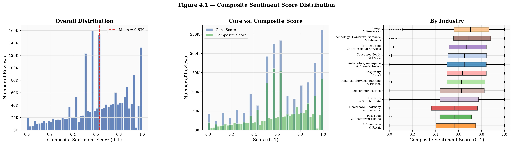
    &nbsp;&nbsp;
    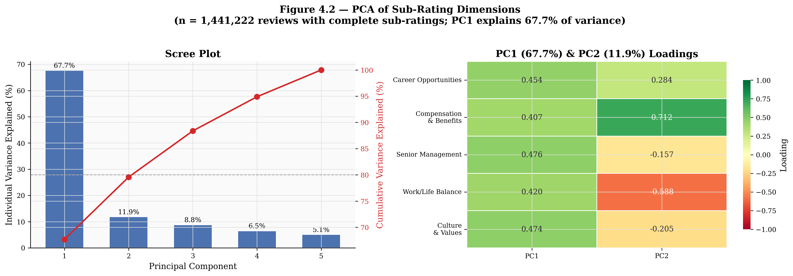
  </p>
  <p align="center"><em>Left: Distribution of the Composite Sentiment Index across 1.9M reviews. Right: PCA validation — PC1 explains 67.7% of sub-rating variance, confirming a strong common factor.</em></p>

  <p align="center">
    
    &nbsp;&nbsp;
    
  </p>
  <p align="center"><em>Left: Panel regression coefficient across four models — the key transition from near-zero (Pooled OLS) to significantly negative (Two-Way FE). Right: The negative effect strengthens at
  longer horizons (1m → 3m → 6m), ruling out noise.</em></p>

  <p align="center">
    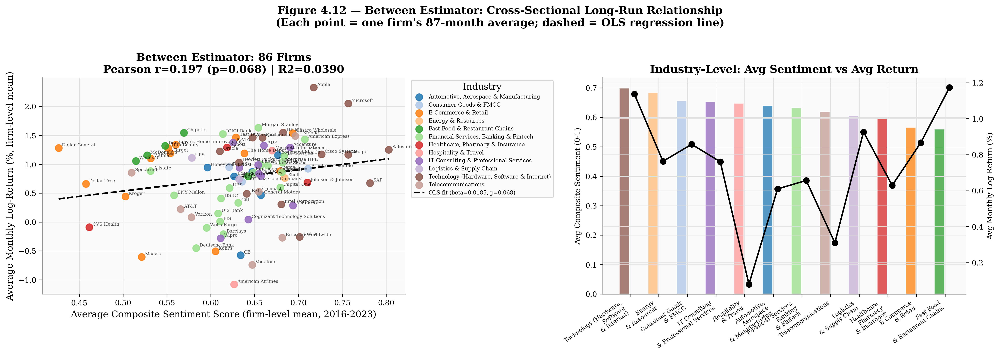
    &nbsp;&nbsp;
    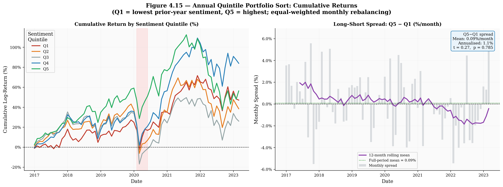
  </p>
  <p align="center"><em>Left: Between estimator — 86-firm cross-section shows positive but marginally non-significant trend (β = +0.018, p = 0.068). Right: Quintile portfolio cumulative returns and the Q5−Q1
  long-short spread.</em></p>

  ### COVID-19 Natural Experiment — Organisational Resilience

  <p align="center">
    
  </p>
  <p align="center"><em>High pre-COVID sentiment firms (green) substantially outperformed low-sentiment firms (red) through the pandemic crash and recovery (Jan 2019 – Dec 2021). The divergence emerges during
  recovery, not at the trough.</em></p>

  ### Theoretical Framework — The Dual-Level Sentiment Model

  <p align="center">
    
  </p>
  <p align="center"><em>Our original theoretical contribution. Left: cross-sectional quality signal (higher sentiment → higher average returns). Right: within-firm mean reversion (the market prices in quality
  before the Glassdoor peak).</em></p>

  ### Part II — "What Employees Say": Topic Modelling & Industry Intelligence

  <p align="center">
    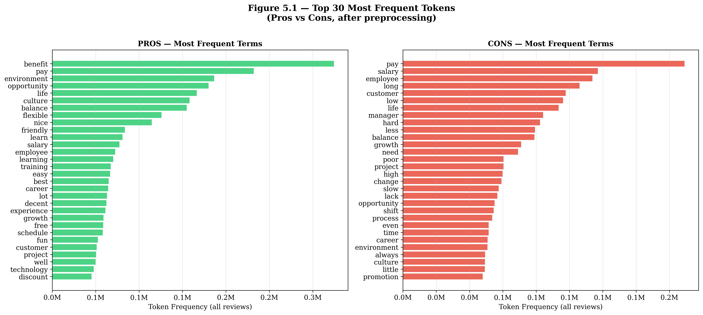
    &nbsp;&nbsp;
    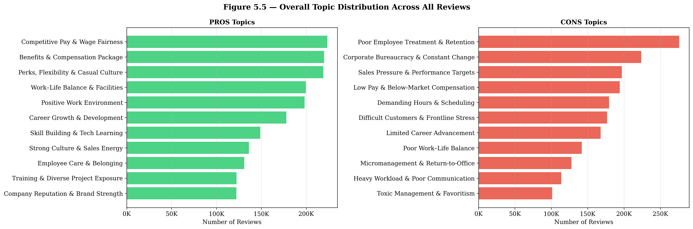
  </p>
  <p align="center"><em>Left: Top 30 most frequent tokens in Pros versus Cons text after preprocessing. Right: Overall topic distribution — 11 interpretable topics discovered in each category via LDA.</em></p>

  <p align="center">
    
    &nbsp;&nbsp;
    
  </p>
  <p align="center"><em>Word clouds for all 11 Pros topics (left) and 11 Cons topics (right). Each cloud represents a discovered latent theme in employee discourse.</em></p>

  <p align="center">
    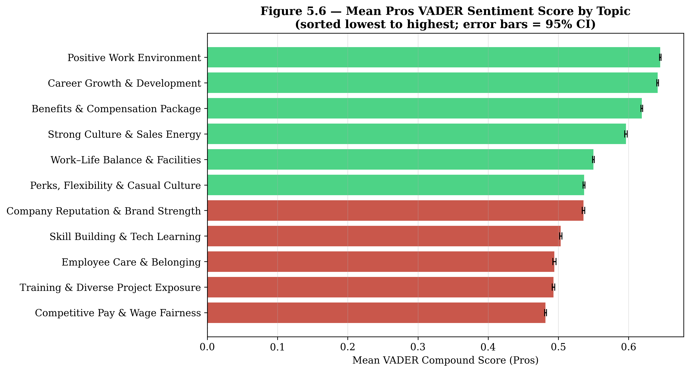
    &nbsp;&nbsp;
    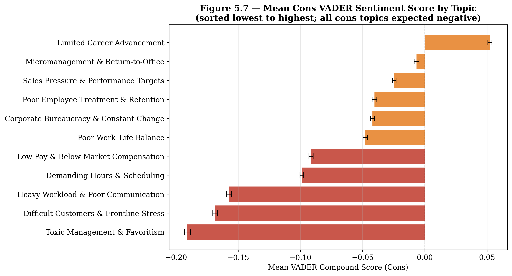
  </p>
  <p align="center"><em>Sentiment–Topic Bridge: mean VADER score by topic. Management and culture topics carry the most intense emotional valence — the highest-leverage intervention point for HR
  leaders.</em></p>

  ### Industry Barometer — For HR Leaders & Policymakers

  <p align="center">
    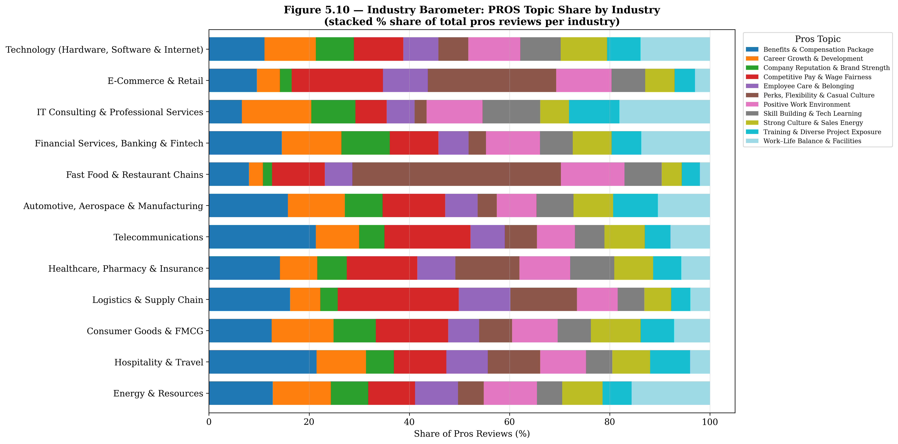
    &nbsp;&nbsp;
    
  </p>
  <p align="center"><em>Left: What employees praise varies dramatically by industry — technology firms discuss career growth, fast-food firms discuss flexibility and perks. Right: Normalised industry heatmap
  across sentiment and rating dimensions.</em></p>

  <p align="center">
    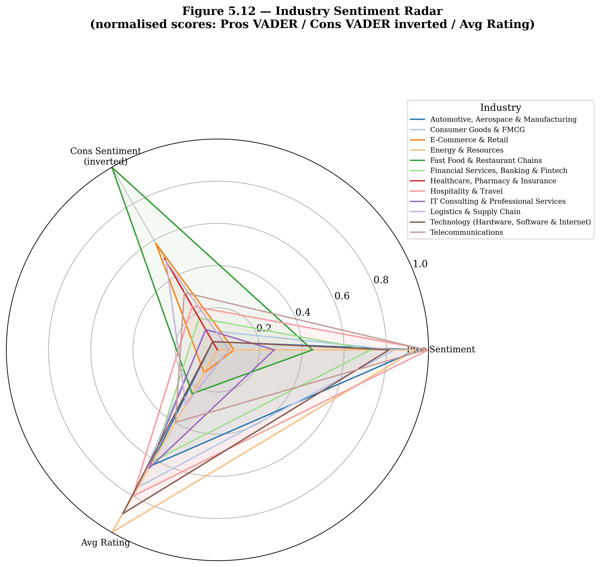
  </p>
  <p align="center"><em>Industry Sentiment Radar: normalised profiles across pros sentiment, cons sentiment (inverted), and average rating for all 12 industries.</em></p>

  ### Firm Competitor Analysis — For Investors & Analysts

  <p align="center">
    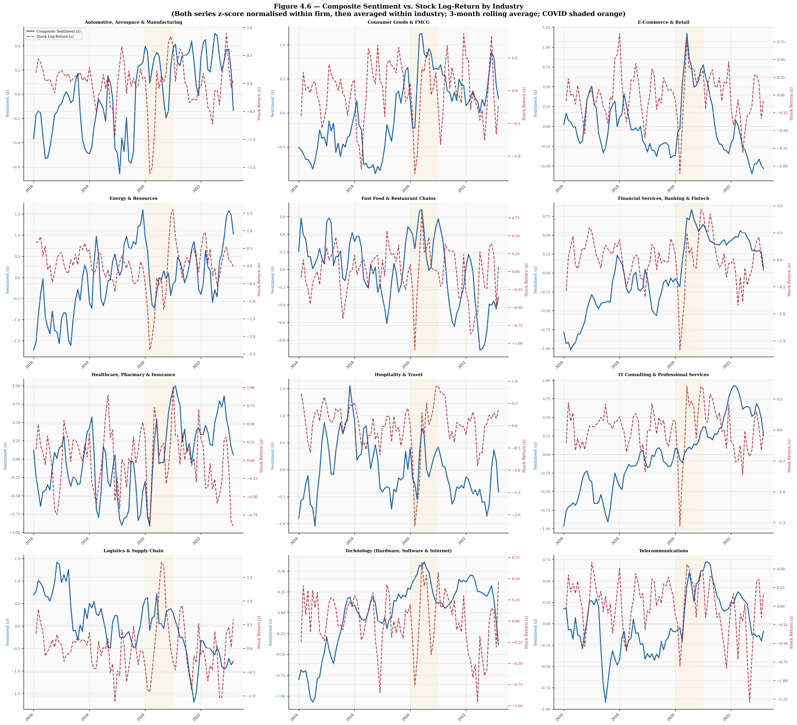
  </p>
  <p align="center"><em>Dual-axis overlay: monthly composite sentiment (z-score) and stock log-return for every firm, grouped by industry. Visual co-movement varies across sectors.</em></p>

  <p align="center">
    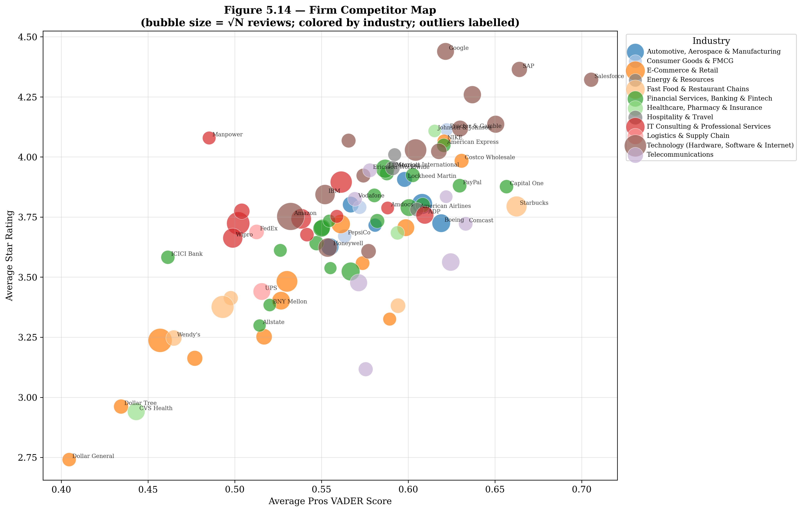
    &nbsp;&nbsp;
    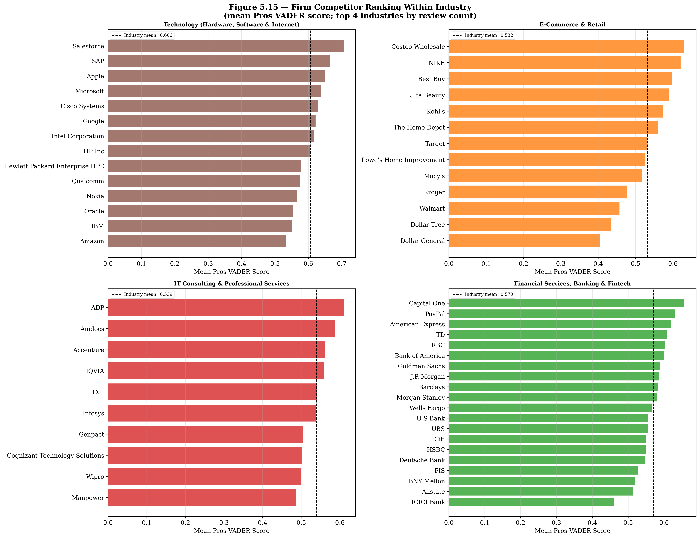
  </p>
  <p align="center"><em>Left: Firm competitor map — pros VADER sentiment vs average rating (bubble size = review volume, colour = industry). Right: Within-industry firm ranking for the four largest
  sectors.</em></p>

  <p align="center">
    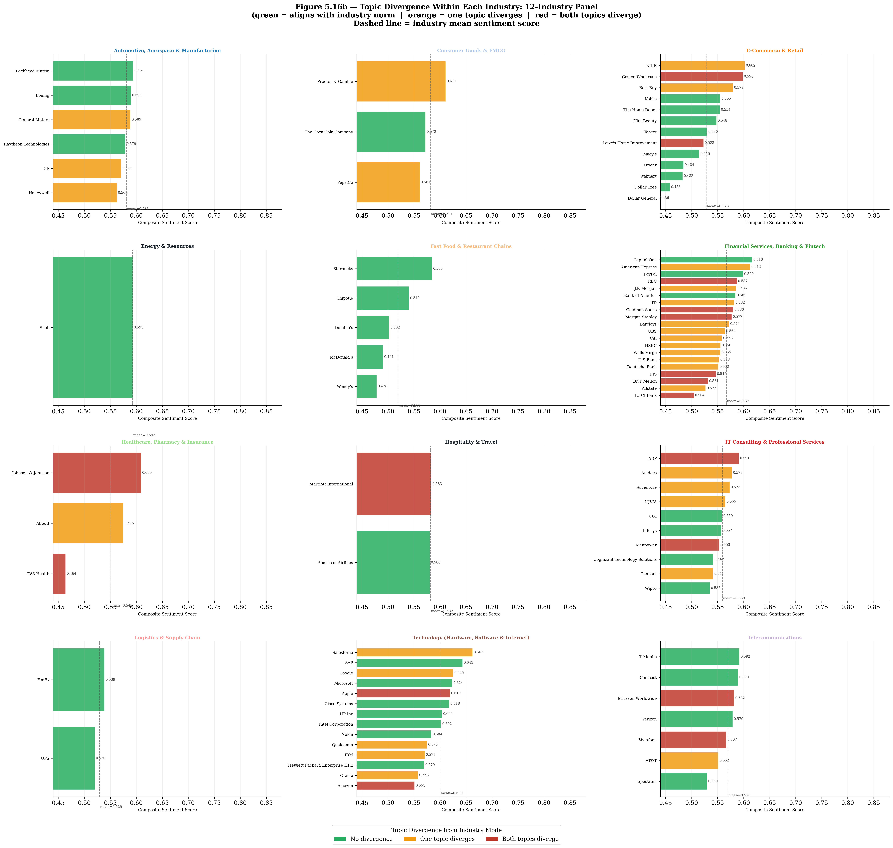
  </p>
  <p align="center"><em>Topic divergence within each industry: green = aligns with industry norm, orange = one topic diverges, red = both topics diverge. Firms deviating from industry norms may face unique
  strategic challenges or opportunities.</em></p>

  ### The Master List — All 86 Firms Ranked

  <p align="center">
    
  </p>
  <p align="center"><em>The complete employee sentiment ranking of all 86 firms across 12 industries, with topic profiles and composite scores. This single figure summarises the entire employee voice landscape
   of our dataset — from the highest-rated to the lowest-rated employer, with their dominant discussion themes and industry context. Covers 1,898,445 reviews spanning January 2016 to March 2023.</em></p>

## Repository Structure

```
📦 thesis-employee-sentiment-stock-performance/
│
├── 📄 README.md                      ← You are here
├── 📄 LICENSE                        ← MIT License
├── 📄 .gitignore
│
├── 📁 data/
│   ├── 📁 0_original/                ← Raw Glassdoor data (large files excluded)
│   ├── 📁 1_preparation/             ← Intermediate processing files
│   └── 📁 2_analysis/                ← Final datasets for analysis
│       ├── monthly_panel.csv         ← 7,482 firm-month panel (main regression data)
│       ├── vader_scores_cache.csv.zip← VADER sentiment scores (1.9M reviews)
│       └── lda_coherence_scores.csv  ← LDA topic coherence results
│
├── 📁 notebooks/                     ← 5 Jupyter notebooks (full pipeline)
│   ├── 1_Data_Availability_Detection.ipynb
│   ├── 2_Dataset_Finalisation.ipynb
│   ├── 3_EDA_Overview.ipynb
│   ├── 4_Sentiment_StockPrice.ipynb  ← Primary analysis (Part I: "Feel")
│   └── 5_TopicModelling_Barometer.ipynb  ← Topic analysis (Part II: "Say")
│
├── 📁 figures/
│   ├── 📁 eda/                       ← 18 exploratory data analysis figures
│   ├── 📁 sentiment/                 ← 31 sentiment & stock price figures
│   └── 📁 topic_modelling/           ← 21 topic modelling figures
│
└── 📁 docs/
    └── Thesis_Presentation.pptx      ← Summary presentation slides
```

---

## Analytical Pipeline

The thesis follows a two-strand design — **"What Employees Feel"** and **"What Employees Say"**:

```
┌─────────────────────────────────────────────────────────────────────┐
│                        DATA PIPELINE                                │
│                                                                     │
│  Glassdoor Reviews ──→ NB1: Detection ──→ NB2: Finalisation        │
│  (raw HTML/CSV)        (87 firms)          (86 firms, 1.9M rows)   │
│                                                                     │
│  Stock Prices ─────────────────────────────→ Monthly log-returns    │
└─────────────────┬───────────────────────────────────┬───────────────┘
                  │                                   │
    ┌─────────────▼──────────────┐     ┌──────────────▼──────────────┐
    │  PART I: "FEEL"            │     │  PART II: "SAY"             │
    │  NB3: EDA Overview         │     │  NB5: Topic Modelling       │
    │  NB4: Sentiment & Stock    │     │       LDA (K=11)            │
    │       Composite Index      │     │       Industry Barometer    │
    │       Panel Regression     │     │       Firm Competitor Map   │
    │       M1→M4 (Pooled→FE)   │     │       Sentiment-Topic       │
    │       Granger Causality    │     │       Bridge                │
    │       Portfolio Sort       │     │                             │
    │       COVID Resilience     │     │                             │
    └─────────────┬──────────────┘     └──────────────┬──────────────┘
                  │                                   │
                  └──────────┬────────────────────────┘
                             │
              ┌──────────────▼──────────────────┐
              │  DUAL-LEVEL SENTIMENT MODEL     │
              │                                 │
              │  Cross-sectional: quality marker │
              │  Within-firm: mean reversion     │
              │  Crisis: resilience proxy        │
              │  Topics: strategic intelligence  │
              └─────────────────────────────────┘
```

---

## Methodology Highlights

| Component | Approach | Key Detail |
|-----------|----------|------------|
| **Composite Index** | Two-tier weighted score | Tier 1 (60%): rating, recommend, CEO, outlook. Tier 2 (40%): 5 sub-ratings |
| **NLP Sentiment** | VADER (Hutto & Gilbert, 2014) | Applied separately to pros and cons text (1.9M reviews) |
| **Panel Regression** | Four specifications | M1: Pooled OLS → M2: Firm FE → M3: Two-Way FE → M4: +Text control |
| **Robustness** | 8 supplementary tests | Granger, reverse causality, portfolio sort, horizon, COVID, Δsentiment |
| **Topic Modelling** | LDA (Blei et al., 2003) | K=11 for both pros and cons; coherence-optimised |
| **Visualisation** | 70 publication-quality figures | Consistent style (DejaVu Serif, 300 DPI, industry colour palette) |

---

## Dataset Overview

| Dimension | Value |
|-----------|-------|
| Total employee reviews | **1,898,445** |
| Firms | **86** (large, publicly listed, US) |
| Industries | **12** |
| Study period | **January 2016 – March 2023** (87 months) |
| Panel observations | **7,482** firm-month (≥5 reviews threshold) |
| Review fields | Rating, 5 sub-ratings, Recommend, CEO Approval, Outlook, Pros text, Cons text |
| Stock data | Monthly closing prices → log-returns |

> **Note:** The full dataset (`Thesis_Dataset_Final.csv`, ~400MB) exceeds GitHub's file size limit and is not included. The `monthly_panel.csv` used for all regressions is included. See `data/` folder READMEs for reproduction instructions.

---

## How to Reproduce

### Requirements

```bash
Python 3.12
pip install pandas numpy matplotlib seaborn scipy statsmodels linearmodels
pip install nltk gensim wordcloud pyLDAvis tqdm
pip install jupyter
```

### Running the Notebooks

```bash
# Clone the repository
git clone https://github.com/YOUR_USERNAME/thesis-employee-sentiment-stock-performance.git
cd thesis-employee-sentiment-stock-performance

# Run notebooks in order
jupyter notebook notebooks/
```

1. **Notebook 1** — Data availability detection (requires original dataset)
2. **Notebook 2** — Dataset finalisation (requires original dataset)
3. **Notebook 3** — EDA overview (requires `Thesis_Dataset_Final.csv`)
4. **Notebook 4** — Sentiment & stock price analysis (requires final dataset + stock prices)
5. **Notebook 5** — Topic modelling & barometer (requires final dataset + VADER cache)

> Notebooks 3–5 can run independently if you have the final dataset. Notebooks 4–5 cache intermediate results (VADER scores, coherence scores) for efficiency.

---

## Citation

If you use this work, please cite:

```
Tian, Y., & Kornietskii, I. (2025). When the floor speaks, does the market listen?
Employee sentiment, stock performance, and the dual-level quality signal
[Master's thesis, BI Norwegian Business School].
```

---

## Authors

| | Name | Programme | Contact |
|--|------|-----------|---------|
| 🎓 | **Yulin Tian** | MSc Strategic Marketing Management | BI Norwegian Business School |
| 🎓 | **Ilia Kornietskii** | MSc Data Science for Business | BI Norwegian Business School |
| 👨‍🏫 | **Auke Hunneman** | Supervisor | Associate Dean of the MSc Business Analytics Program, Associate Professor, BI |

---

## License

This project is licensed under the MIT License. See [LICENSE](LICENSE) for details.

---

<p align="center">
  <em>"What employees feel and say matters — not because it predicts next month's stock return, but because it reveals the quality of the organisation beneath the financial statements."</em>
</p>
